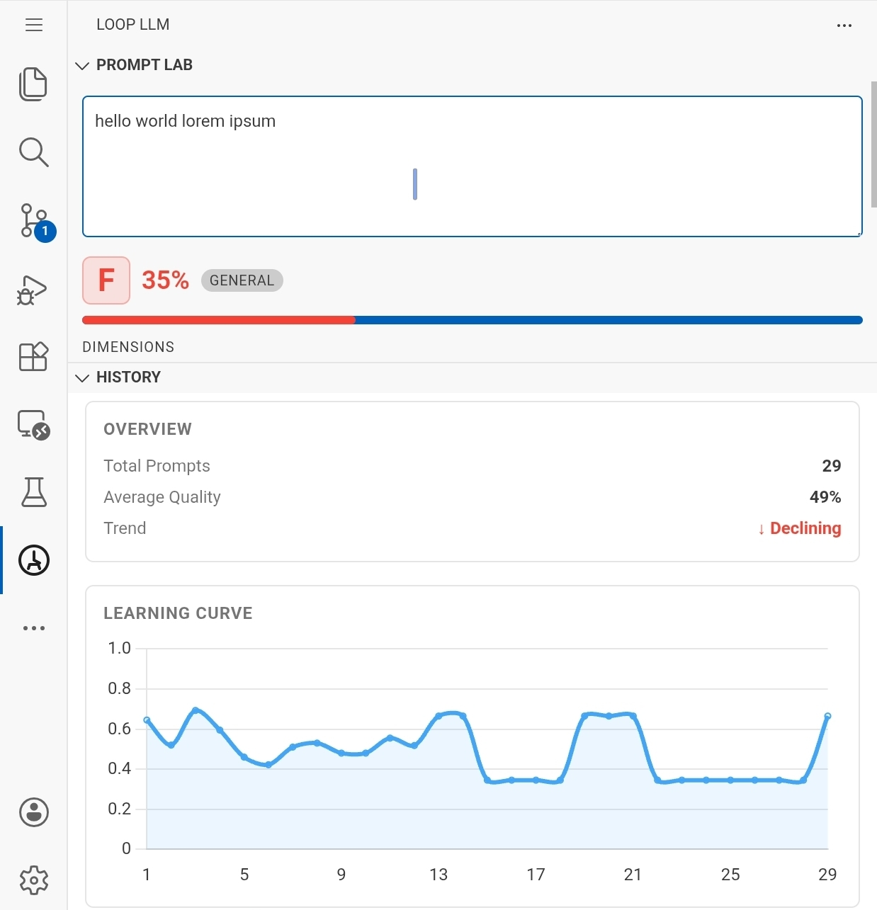
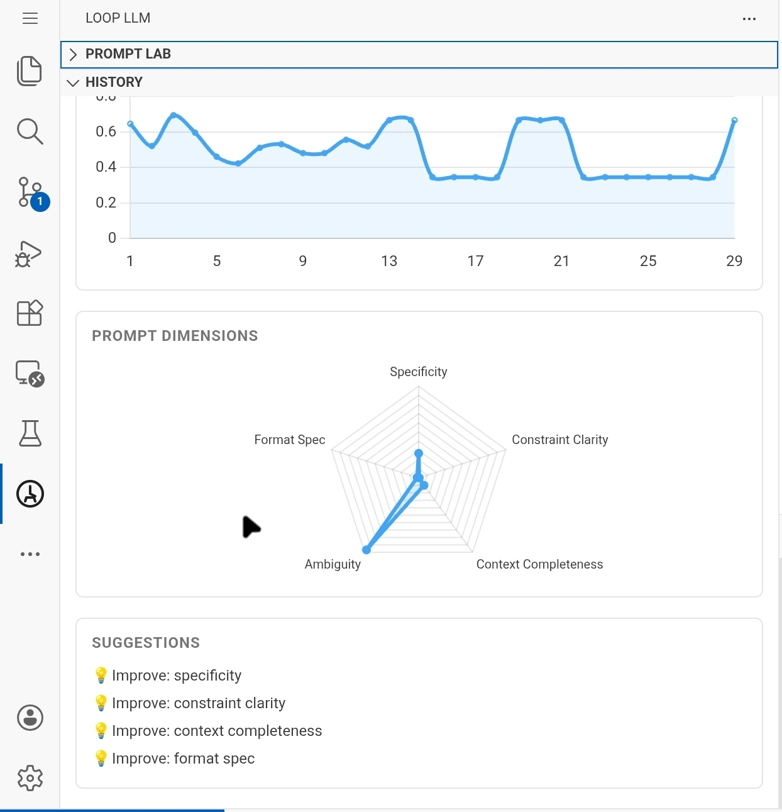
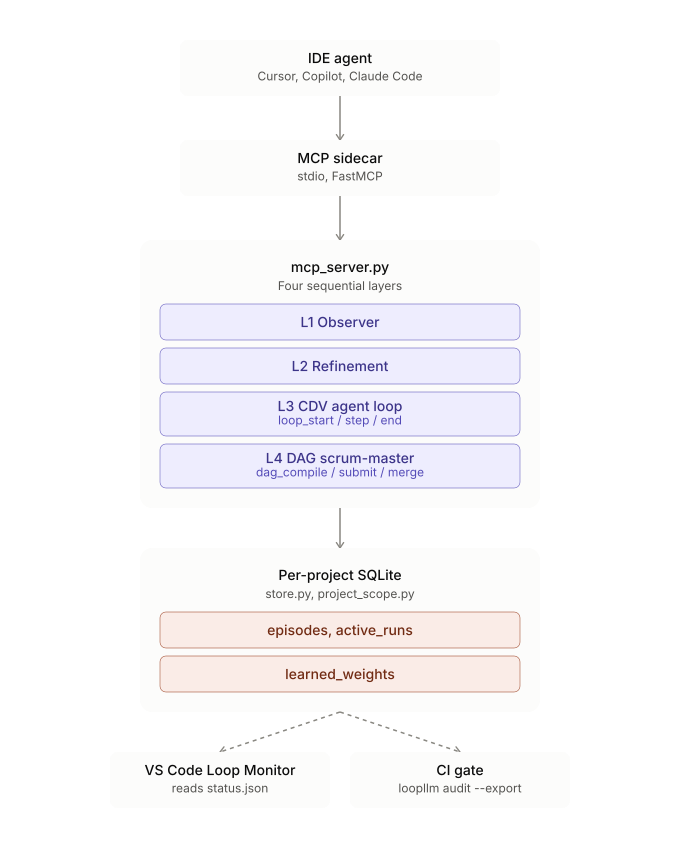
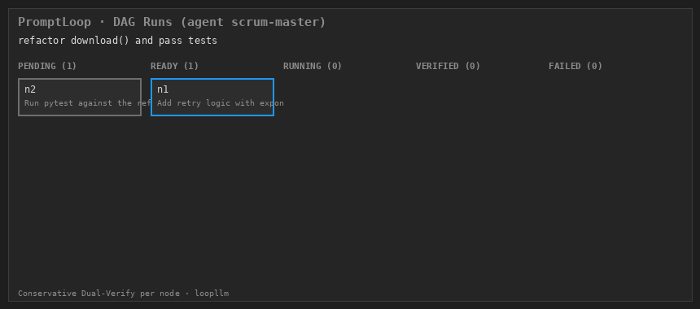

# PromptLoop

[](https://github.com/azank1/loop-llm)

[](https://github.com/azank1/loop-llm/actions/workflows/ci.yml)
[](https://opensource.org/licenses/MIT)
[](https://pypi.org/project/loopllm/)
[](https://marketplace.visualstudio.com/items?itemName=loopllm.loopllm-prompt-gauge)

**Your agent said it works. PromptLoop is the receipt.**

Cursor, Copilot, Claude Code — every agent ends a task with "done, all tests pass."
Sometimes that's true. PromptLoop (package: `loopllm`) sits between your IDE agent
and the model, scores each step the agent submits through **two independent
channels** (a deterministic floor plus an LLM critic — the stricter score wins),
and stamps the verdicts onto your git history as an **audit trail** you can review,
export, or gate CI on. No API key, no cloud, nothing leaves your machine.

What a caught lie looks like (real tool output):

```
loopllm_loop_start(goal="make the failing test pass", task_type="bugfix")
  → { suggested_budget: 3, quality_threshold: 0.8, evaluator_type: "composite" }

loopllm_loop_step(session_id, step_output="pytest: 3 failed, 12 passed")
  → {
      decision: "continue",
      score: 0.0,
      channel_a_score: 0.0,      ← deterministic floor: "tests passed" not found
      channel_b_score: 0.55,     ← LLM critic was more forgiving — vetoed
      deficiencies: ["Required pattern not found: tests passed"],
    }
```

The agent *reported* progress. The receipt says otherwise — and the loop keeps
going until the evidence, not the agent, says it's done.

---

## Quickstart

Published on [PyPI](https://pypi.org/project/loopllm/) as `loopllm`. Two ways to use it: the **CLI** (try in seconds) and the **MCP server** (main use — plugs into Cursor / VS Code / Claude Code).

### Install

```bash
pipx install "loopllm[mcp]"          # cleanest — isolated, puts loopllm on PATH
```

On Ubuntu/Debian, bare `pip install loopllm` fails with `externally-managed-environment` (PEP 668). Use pipx (above), or a venv:

```bash
python3 -m venv ~/.venvs/loopllm
~/.venvs/loopllm/bin/pip install "loopllm[mcp]"
# CLI is then at ~/.venvs/loopllm/bin/loopllm
```

### Try it in 5 seconds — score a prompt (no MCP, no API key)

```bash
loopllm score "write me some code"
loopllm score "add retry with backoff to download(); raise after 3 tries" --json
```

Fully offline. Writes gauge state to `~/.loopllm/status.json` (VS Code extension picks it up).

### Main use — MCP server in Cursor / VS Code / Antigravity / Claude Code

The server runs over stdio; your IDE's agent launches it. One command registers it
in whichever IDEs you have installed, merging into any existing MCP config instead
of overwriting it:

```bash
loopllm install-mcp --ide all          # cursor + vscode + antigravity
loopllm install-mcp --ide claude-code  # project-scoped .mcp.json (commit it — see below)
```

Then reload the IDE. In agent chat you'll have the `loopllm_*` tools.

If you installed in a venv (not pipx), edit the written config's `"command"` to the
absolute venv path (e.g. `/home/you/.venvs/loopllm/bin/loopllm`) — the IDE won't
see your venv's PATH. `--provider agent` (the default) uses your IDE's model via
MCP sampling; no API key needed.

<details>
<summary>Prefer to edit the MCP config by hand?</summary>

**Cursor** — `.cursor/mcp.json` in your project (or `~/.cursor/mcp.json` globally):

```json
{
  "mcpServers": {
    "loopllm": {
      "command": "loopllm",
      "args": ["mcp-server", "--provider", "agent"]
    }
  }
}
```

**VS Code** (Copilot agent mode) / **Antigravity** — `.vscode/mcp.json` or the
equivalent user-scoped `mcp.json`:

```json
{
  "servers": {
    "loopllm": {
      "type": "stdio",
      "command": "loopllm",
      "args": ["mcp-server", "--provider", "agent"]
    }
  }
}
```

**Claude Code** — `.mcp.json` at the project root (project-scoped, meant to be
committed so the whole team gets the same server):

```json
{
  "mcpServers": {
    "loopllm": {
      "command": "loopllm",
      "args": ["mcp-server", "--provider", "agent"]
    }
  }
}
```

</details>

Verify on first load:

```
use loopllm_loop_start with goal="make the failing test pass" task_type="bugfix"
```

> **Making the agent actually use it.** MCP is advisory — nothing can force an IDE
> agent to call loopllm. Two answers: `install-mcp` can drop rules/instruction
> files that tell your agent to consult PromptLoop (see
> `loopllm install-mcp --help`), and the VS Code Loop Monitor shows an
> undismissable banner — *"PromptLoop has not been consulted this session"* —
> whenever you've been editing but the agent hasn't called an entry-point tool.
> Silent non-adoption becomes visible instead of invisible.

---

## The receipt — Conservative Dual-Verify (Layer 3)

Most agent loops stop on a fixed `max_iterations` or let the agent self-grade when
it's "done." Both waste tokens or optimize **reported** progress. PromptLoop's
**Conservative Dual-Verify**: agents submit step **artifacts** (test logs, diffs,
summaries); the MCP server scores them through **two channels** and feeds the
**stricter** score into Bayesian stop/continue logic.

```python
channel_a = deterministic_evaluator.evaluate(step_output)   # regex, JSON, completeness
channel_b = critic_sample(step_output, goal, criteria)      # critic-role call, same sampled model
final_score = min(channel_a, channel_b)                     # either channel can veto
```

Channel A is a hard, model-independent floor (regex/JSON/completeness — it can't be
argued with). Channel B today calls the *same* MCP-sampled model as the agent
itself, just under an "independent verifier" prompt role, not a genuinely separate
model — see [Known limitations](#known-limitations) for why that matters and what
would close the gap.

`loopllm_loop_step` returns `stop` when any guard fires: goal reached (verified score),
plateau, low Bayesian ROI, budget exhausted, timeout, token cap, or repeated output.

What a terminal run looks like:

```text
=== Loop (task_type=bugfix) ===
Suggested budget: 3 step(s) | threshold 0.80 | confidence 0.00 (from 0 past loops)
  step  1 | 0.45 |#########           | -> CONTINUE: step 1/3, score 0.450 below 0.80
  step  2 | 0.85 |#################   | -> STOP: Goal reached: 0.850 >= 0.80 at step 2
```

**Session continuity.** Every verified `loopllm_loop_step` is checkpointed. If the
MCP server or IDE restarts, in-progress loops rehydrate on startup;
`loopllm_run_status` shows them and `loopllm_loop_resume` continues where they left
off. Each verdict also reports `cdv_mode` (`full` when an independent critic ran via
MCP sampling, `channel_a_only` when only deterministic checks ran).

### The audit trail

Every recorded episode (agent loop or DAG node) is stamped with the git commit that
was `HEAD` at the time:

- `loopllm audit --since origin/main` — human-readable report of what the agent did
  on this branch and how it was verified. The reviewable record you can point to.
- `loopllm audit --export .loopllm/audit.json` — the same trail as a portable
  artifact you commit alongside the code it verifies.
- `loopllm audit-gate --since origin/main [--min-score X] [--require-verified]` —
  read it back in CI and check every commit in the PR. Without the enforcement
  flags it only reports, so you can dogfood before turning it on. See
  [`.github/workflows/loopllm-gate.yml`](.github/workflows/loopllm-gate.yml) for
  this repo's own (report-only) setup, or drop the reusable
  [`.github/actions/loopllm-gate`](.github/actions/loopllm-gate/action.yml)
  composite action into another repo's workflow.
- The VS Code Loop Monitor's **Export audit** button opens the same report as a
  markdown document.

---

## VS Code Extension — the verification board

The extension is the face of PromptLoop: a live prompt-quality scratchpad, the CDV
loop monitor, and a history dashboard in the sidebar. It reads the same per-project
SQLite state the server writes — no cloud, no account.

<table>
<tr>
<td width="50%" valign="top">

**Prompt Lab** — live quality scratchpad



Scores on every keystroke (350 ms debounce). Grade badge, 5 dimension bars, issues + suggestions tags, Copy and Send to Chat. The free, zero-setup hook — "ESLint for your prompts."

</td>
<td width="50%" valign="top">

**History** — learning curve + metrics



Learning curve sparkline, grade distribution, SGD learned weights per dimension. Updates after every `loopllm_feedback` call.

</td>
</tr>
</table>

Install from the [VS Code Marketplace](https://marketplace.visualstudio.com/items?itemName=loopllm.loopllm-prompt-gauge):

```bash
code --install-extension loopllm.loopllm-prompt-gauge
```

Cursor does not use the Microsoft Marketplace — until the extension is on
[Open VSX](https://open-vsx.org/), sideload the VSIX (build from source below, or
grab a release artifact) with `cursor --install-extension <path-to.vsix>`.

<details>
<summary>Build from source (contributors)</summary>

```bash
cd vscode-loopllm
npm install
npx @vscode/vsce package --no-dependencies   # loopllm-prompt-gauge-0.3.1.vsix
code --install-extension loopllm-prompt-gauge-0.3.1.vsix
```

</details>

---

## Memory model

Every repo gets its own store: PromptLoop resolves a per-project id from your git
remote (falling back to the repo root, then the working directory) and keys all
local state under `~/.loopllm/projects/<id>/store.db` — two unrelated repos never
share episodes, priors, or active runs. Override auto-detection with `LOOPLLM_PROJECT`
(e.g. in CI, or a worktree that should share state with its main clone). Run
`loopllm paths` to see the resolved directory for the current repo.

Upgrading from v0.9 or earlier? Your old global `~/.loopllm/store.db` isn't
lost — run `loopllm migrate-legacy` in each project that should inherit its
learned priors and episodes (or set `LOOPLLM_DB` to keep using it directly).

Two complementary memory layers in this per-project store:

| Layer | What it learns | MCP tools |
|---|---|---|
| **Meta-memory** | Optimal loop depth, convergence rate, scoring weights | `loopllm_loop_end`, `loopllm_feedback` |
| **Episodic memory** | Summaries of past loops/plans — keyword recall | `loopllm_recall`, `loopllm_run_status`, `loopllm_loop_resume` |

Episodic memory is **not** full chat RAG — it stores compressed outcomes so the next
loop of the same task type can recall *what worked before*. Recall is also injected
automatically: `loopllm_loop_start` returns `similar_episodes`, and
`loopllm_intercept` flags `recall_available` on clear prompts. (Ranking is
deterministic keyword overlap today; the seam is stable for an FTS5/vector upgrade.)

This is the retention loop: the longer PromptLoop runs in your repo, the better it
knows how many steps your bugfixes actually take and what "done" looked like last
time.

---

## The rest of the stack

PromptLoop adds four capabilities on top of your agent harness. Layers 3 (CDV, above)
and the audit trail are the product; the others support them:

| Layer | Entry point | What it does |
|---|---|---|
| 1 — Prompt observer | `loopllm_intercept` | Score every prompt across 5 dimensions, route to elicitation/refinement |
| 2 — Refinement pipeline | `loopllm_run_pipeline` | Elicit → decompose → execute → verify inline via MCP sampling |
| 3 — CDV agent loops | `loopllm_loop_start` / `loop_step` / `loop_end` | Dual-verify step artifacts → guards → Bayesian stop |
| 4 — DAG scrum-master *(experimental)* | `loopllm_dag_compile` / `dag_ready` / `dag_submit` / `dag_merge` | Decompose a goal into dependency-ordered nodes; CDV-verify each independently |

All layers share one Bayesian learning core (`AdaptivePriors` + SQLite) — no
training data, no PyTorch.



### Layer 1 — prompt scoring

`loopllm_intercept` scores across 5 dimensions (< 1 ms, deterministic), routes
weak prompts to elicitation (Thompson Sampling picks the highest-gain question),
and learns your preferences via online SGD on `loopllm_feedback` ratings.

| Dimension | What it catches |
|---|---|
| Specificity | Vague, generic requests |
| Constraint Clarity | Missing format, length, or rule requirements |
| Context Completeness | No background or goal stated |
| Ambiguity | Unclear references, pronouns without antecedents |
| Format Specification | No output format specified |

### Layer 2 — refinement pipeline

`loopllm_run_pipeline` runs observe → elicit → refine → verify in one tool call:
score the prompt, ask clarifying questions if quality < 0.6, decompose if complex,
execute each subtask via `ctx.sample()` with evaluate-and-retry, verify the
assembled output, log everything to SQLite. No extra chat turns, no polling.

<details>
<summary>Learning math (SGD, Thompson Sampling, Bayesian priors)</summary>

### Online Gradient Descent on scoring weights

Default weights: `{specificity: 0.25, constraint_clarity: 0.20, context_completeness: 0.20, ambiguity: 0.20, format_spec: 0.15}`. Each `loopllm_feedback(rating)` runs one SGD step; weights clip to $[0.05, 0.50]$ and renormalise. Persisted in `learned_weights` (schema v4).

### Thompson Sampling for question ordering

Each question type maintains $\text{Beta}(\alpha, \beta)$; the pipeline draws $s_i \sim \text{Beta}(\alpha_i, \beta_i)$ and picks $\arg\max_i s_i$.

### Beta-Binomial Bayesian priors

Per-(task\_type, model) convergence priors drive adaptive exit in `adaptive_exit.py` via `BetaPrior.prob_above(threshold)`.

### Welford online variance

`NormalPrior` tracks running mean/variance with optional exponential decay ($\lambda = 0.95$).

</details>

---

## Use it as a library — `AdaptiveStopper` (no MCP)

For LangGraph / CrewAI / AutoGen or a hand-rolled loop, `AdaptiveStopper` turns the
CDV controller into one enforced `should_continue(state)` predicate. If `state`
carries a verified `score` it's used; otherwise the artifact in `state["output"]`
is scored locally with the deterministic Channel-A evaluator — so the router stops
the loop, not the model's self-grade.

```python
from loopllm import AdaptiveStopper

stop = AdaptiveStopper(
    goal="make the failing tests pass", task_type="bugfix",
    evaluator_type="regex", required_patterns=[r"0 failed"], max_tokens=20_000,
)

# LangGraph conditional edge:
graph.add_conditional_edges("agent", lambda s: stop.route(s, "agent", "END"))

# or any while-loop:
while stop.should_continue(state):   # state = {"output": artifact, "tokens": n}
    state = run_agent_step(state)
```

The same controller is available directly (CDV runs over MCP; here it's driven with
pre-scored steps):

```python
from loopllm import AdaptivePriors, AgentLoopController

controller = AgentLoopController(AdaptivePriors())
session = controller.start("fix flaky test", task_type="bugfix")
verdict = controller.step(session.session_id, score=0.9)   # library API (pre-scored)
controller.end(session.session_id)
```


### Benchmark: adaptive vs fixed `max_iterations`

Reproducible simulation (seed=7, 300 test tasks, threshold 0.80) — **a synthetic
simulation of the decision policy, not a live-LLM evaluation** (see
[Known limitations](#known-limitations)):

| Strategy | Mean steps | Mean final score | % reaching 0.80 | Wasted steps | Efficiency (reach/step) |
|---|---|---|---|---|---|
| fixed (budget=2) | 2.00 | 0.698 | 34.3% | 0.00 | 17.2 |
| fixed (budget=6) | 6.00 | 0.939 | 94.0% | 2.50 | 15.7 |
| threshold (reactive) | 3.56 | 0.852 | 100.0% | 0.00 | 28.1 |
| **adaptive (loopllm)** | **3.56** | **0.852** | **99.7%** | **0.00** | **28.0** |

**Adaptive uses ~41% fewer steps than a fixed 6-step budget** while reaching the bar
on 99.7% of tasks.

> Honest caveat: simulation with stated assumptions; measures *decision efficiency
> given a quality signal*, not absolute model quality. It exercises the real
> `AgentLoopController`/`AdaptivePriors` decision policy, but against a
> hand-crafted score curve, not real Conservative Dual-Verify (Channel A + B)
> scored trajectories — and the script generating this table isn't in the
> current working tree (see [Known limitations](#known-limitations)).

---

## Experimental

Built and tested, but not the focus — use if you're curious:

- **DAG scrum-master (Layer 4).** `loopllm_dag_compile` decomposes a goal into
  dependency-ordered virtual sub-agent nodes; each is CDV-verified independently
  before its dependents unlock; `loopllm_dag_merge` combines verified outputs in
  topological order. The Loop Monitor renders this as a kanban board.

  

- **REST scoring endpoint.** `pipx install "loopllm[serve]" && loopllm serve
  --port 8765` — score prompts over HTTP, e.g. for Ollama/llama.cpp loops:

  ```python
  from loopllm.local_loop import LocalModelLoop

  loop = LocalModelLoop(
      base_url="http://localhost:11434",
      model="llama3.2",
      score_url="http://localhost:8765/score",
      quality_threshold=0.80,
      max_retries=3,
  )
  result = loop.run("Write a Python function to parse JSON safely.")
  ```

- **Local / third-party providers.** `loopllm mcp-server --provider ollama
  --model qwen2.5` or `--provider openrouter` instead of MCP sampling.

---

## Known limitations

- **Session-scoped, single machine.** State lives in a per-project SQLite file
  under `~/.loopllm/`; there is no cloud-native execution, so a loop can't run
  while the machine is off or continue across machines. Verification and
  learning act on one project (one commit range) at a time — this is not a
  multi-repo or multi-agent-fleet system.
- **Channel B is not yet a genuinely separate model.** `score_channel_b` calls
  `ctx.sample()` — the same MCP-sampled model the agent itself is using —
  differentiated only by an "independent verifier" prompt role, not a distinct
  model. Some of the value of a second channel comes from a different model
  not sharing the first model's blind spots; that isn't wired up yet. Channel
  A's deterministic floor still applies regardless of which model runs
  Channel B.
- **Channel B's token cost is untracked.** Every CDV step that runs Channel B
  is a second LLM call (up to ~3000 input characters of step output plus goal
  and criteria, up to 500 output tokens) on top of the agent's own step. This
  overhead isn't currently measured or surfaced in the verdict JSON or
  `loopllm_report`.
- **The adaptive-vs-fixed benchmark above is a synthetic simulation**, not a
  live-LLM evaluation: it exercises the real `AgentLoopController` /
  `AdaptivePriors` decision policy, but against a hand-crafted
  diminishing-returns curve, not real CDV (Channel A + B) scored
  trajectories. The script itself isn't in the current working tree —
  recoverable via `git show <rev>:benchmarks/adaptive_vs_fixed.py` (e.g.
  `92aa875` or earlier) — so treat the table as a lower bound on rigor, not a
  validated production result.

---

## Tools (36)

| Tool | What it does |
|---|---|
| `loopllm_loop_start` | **Layer 3.** Begin CDV agent loop; returns learned budget + verifier recipe |
| `loopllm_loop_step` | Submit step artifact for CDV; returns continue/stop + channel scores |
| `loopllm_loop_end` | Close loop and learn optimal depth from verified trajectories |
| `loopllm_loop_status` | Inspect an active agent-loop session |
| `loopllm_loop_resume` | Resume an in-progress agent loop after an IDE reload or MCP restart |
| `loopllm_run_status` | Active loop/plan/DAG run snapshots for crash recovery |
| `loopllm_recall` | Keyword recall of similar past episodes |
| `loopllm_run_pipeline` | **Layer 2.** Elicit → decompose → execute → verify in one call |
| `loopllm_intercept` | **Layer 1.** Score + route a prompt; logs to history |
| `loopllm_gauge` | Instant quality bars, no DB write |
| `loopllm_refine` | Score → sample → retry loop via MCP Sampling |
| `loopllm_plan_tasks` | Decompose a goal into ordered subtasks via MCP Sampling |
| `loopllm_verify_output` | Keyword pre-check + deep sample against quality criteria |
| `loopllm_elicitation_start/answer/finish` | Multi-turn clarifying question session |
| `loopllm_plan_register` | Create a confidence-gated plan saved to SQLite |
| `loopllm_plan_next` | Advance to next task; returns `needs_replan` if quality dropped |
| `loopllm_plan_update` | Record task scores; recalculates rolling confidence |
| `loopllm_plan_list` | Dashboard: all plans with gauges and task counts |
| `loopllm_plan_delete` | Remove a completed or abandoned plan |
| `loopllm_context_history` | Browse prompt history with sparklines |
| `loopllm_context_clear` | Wipe prompt history (scoped or all) |
| `loopllm_prompt_stats` | Prompting quality trend and learning curve |
| `loopllm_feedback` | Rate a response (1–5); triggers SGD weight update |
| `loopllm_suggest_config` | Bayesian-optimal loop config for a task type |
| `loopllm_dag_compile` | *(Experimental.)* Compile a goal into a dependency-ordered DAG of virtual sub-agent nodes |
| `loopllm_dag_ready` | Return frontier DAG nodes whose dependencies are verified |
| `loopllm_dag_submit` | Submit a DAG node step artifact for CDV scoring |
| `loopllm_dag_status` | Full DAG graph state: node states, scores, ready frontier |
| `loopllm_dag_merge` | Merge verified DAG node outputs in topological order |
| `loopllm_classify_task` | Label a prompt's task type |
| `loopllm_analyze_prompt` | Generate clarifying questions ranked by Thompson-sampled gain |
| `loopllm_list_tasks` | List tasks from the persistent store |
| `loopllm_show_task` | Detail view for a single task |
| `loopllm_report` | Learned weights, Bayesian priors, question effectiveness stats |

Plans, episodes, and learned weights persist to a per-project `~/.loopllm/projects/<id>/store.db` (schema v6).

> Current release: **v0.11.0** — CDV agent loops + audit trail (v0.7, v0.10), episodic memory (v0.8), DAG virtual sub-agents (v0.9, experimental), CI audit-gate + `install-mcp --rules` (v0.11). See [CHANGELOG.md](CHANGELOG.md).

---

## Develop from source

```bash
git clone https://github.com/azank1/loop-llm   # GitHub repo still named loop-llm
cd loop-llm
pip install -e ".[dev]"
python -m pytest tests/ -q          # ~300 tests, ~3s
```

Committed [`.cursor/mcp.json`](.cursor/mcp.json) and [`.vscode/mcp.json`](.vscode/mcp.json) use `"command": "loopllm"` (expects pipx or PATH). For a repo-local venv, point `command` at `.venv/bin/loopllm`.

See [CONTRIBUTING.md](CONTRIBUTING.md) for branch naming (`az/<type>/<short>`) and checks.
Maintainers cutting a release should follow [RELEASING.md](RELEASING.md).

**Key files:**
- `src/loopllm/mcp_server.py` — 36 MCP tools + MCP Sampling helpers
- `src/loopllm/step_scorer.py` — Conservative Dual-Verify scoring
- `src/loopllm/agent_loop.py` — adaptive agent-loop controller
- `src/loopllm/guards.py` — composable agent-loop stop stack
- `src/loopllm/evaluator_factory.py` — build evaluators for CDV Channel A
- `src/loopllm/priors.py` — Beta/Normal priors, Welford, Thompson Sampling
- `src/loopllm/store.py` — SQLite persistence (schema v6)
- `src/loopllm/episodes.py` — episodic memory record/recall
- `src/loopllm/dag_scheduler.py` — DAG virtual sub-agents (experimental)
- `src/loopllm/engine.py` — core refinement loop (`LoopedLLM`)

PRs welcome. Add tests for new tools in `tests/`.

---

## Environment variables

| Variable | Default | Description |
|---|---|---|
| `LOOPLLM_PROVIDER` | `agent` | `agent`, `ollama`, or `openrouter` |
| `LOOPLLM_MODEL` | `agent` | Model identifier (ignored in agent mode) |
| `LOOPLLM_DB` | `~/.loopllm/store.db` | SQLite store path |
| `LOOPLLM_PROJECT` | auto-detected | Override per-project state scoping |
| `OLLAMA_HOST` | `http://localhost:11434` | Ollama base URL |
| `OPENROUTER_API_KEY` | — | OpenRouter API key |

---

## License

MIT
