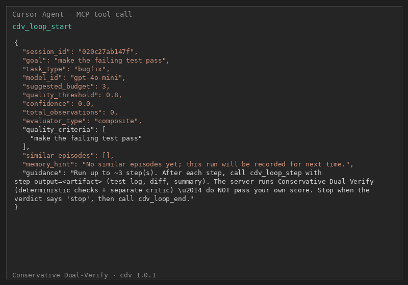

# CDV — Conservative Dual-Verify

[](https://github.com/azank1/cdv/actions/workflows/ci.yml)
[](https://github.com/azank1/cdv/actions/workflows/ci.yml)
[](https://github.com/azank1/cdv)
[](https://opensource.org/licenses/MIT)

**Judging AI agent work with a deterministic floor and an LLM critic — the
stricter score wins, and a Bayesian policy decides when to stop.**



*An agent claims "tests pass." Channel A (deterministic) finds no evidence and
vetoes; the loop continues. Only when both channels agree does the run stop —
and the verdicts are stamped onto git history.*

> **Status: research preview.** This repository is the published concept,
> frozen at **v1.0.1**. Active development continues privately; issues and PRs
> here may not be answered. The code is MIT — read it, cite it, fork it.

---

## The problem

Agent loops today end in one of two ways:

- **Fixed `max_iterations`** — cheap and wrong: either the loop stops while the
  work is unfinished, or it burns tokens long after the work is done.
- **The agent grades itself** — and agents optimize *reported* progress. "Done,
  all tests pass" is a claim, not evidence.

Both failure modes come from the same place: the entity deciding to stop is the
entity being judged. CDV separates them.

## The method

Two loops, one handoff:

```
        elicitation loop                        judgment loop
 ┌──────────────────────────┐   intent    ┌───────────────────────────────┐
 │ score prompt (5 dims)    │  (goal +    │  agent runs — externally,     │
 │ clarify via Thompson-    │  criteria + │  in your IDE                  │
 │ sampled questions        │  patterns)  │        │                      │
 │ refine until specific    │ ──────────► │        ▼                      │
 └──────────────────────────┘             │  step artifact (test log,     │
                                          │  diff, summary)               │
                                          │        │                      │
                                          │        ▼                      │
                                          │  Channel A: deterministic     │
                                          │  Channel B: LLM critic        │
                                          │  score = min(A, B)  ← veto    │
                                          │        │                      │
                                          │        ▼                      │
                                          │  Bayesian stop/continue       │
                                          └───────────────────────────────┘
```

- **Elicitation loop.** A weak prompt is scored across five dimensions
  (specificity, constraint clarity, context completeness, ambiguity, format
  specification) and clarified before any tokens are spent on execution.
  Question order is Thompson-sampled on Beta priors, so the questions that
  historically resolved the most uncertainty get asked first.
- **The handoff.** What passes between the loops is *intent made checkable*: a
  goal, quality criteria, and required evidence patterns. The agent runs
  entirely outside CDV — in Cursor, Copilot, Claude Code, whatever you use.
- **Judgment loop.** Each step the agent claims is submitted as an *artifact*
  (a test log, a diff — never a self-assigned score) and judged twice:
  - **Channel A** — deterministic evaluators (regex/JSON/completeness). A hard
    floor that cannot be argued with.
  - **Channel B** — an LLM critic under an independent-verifier prompt role.
  - **Fusion is `min(A, B)`, deliberately.** Not a weighted average — either
    channel can veto. Weighted ensembles let a lenient channel dilute a
    strict one; min-fusion can't be diluted, only vetoed.
- **Stopping is a decision problem, not a counter.** A Beta prior tracks
  convergence probability per task type; Normal priors (Welford online
  variance) track score, delta, and latency; a composable guard stack (goal
  reached, plateau, low expected ROI, budget, timeout, token cap, repeated
  output) converts those into a stop/continue verdict.

## Research notes

Pointers into the code for the concepts being explored:

1. **Conservative fusion for LLM judges** — `src/cdv/step_scorer.py`.
   `min(A, B)` treats verification like a security property: the paranoid
   channel sets the ceiling.
2. **Optimal stopping for agent loops** — `src/cdv/priors.py`,
   `src/cdv/adaptive_exit.py`, `src/cdv/guards.py`. Bayesian ROI: stop when the
   expected score gain of another step falls below its cost.
3. **Prompt quality as a learnable rubric** — `src/cdv/engine.py`,
   `src/cdv/elicitation.py`. Five deterministic dimensions composited by
   weights updated online via SGD on user feedback; the VS Code extension
   scores live with a 350 ms debounce.
4. **Two-tier memory** — `src/cdv/episodes.py`, `src/cdv/store.py`.
   *Episodic* memory recalls what worked on similar past tasks; *meta* memory
   learns how many steps a task type actually takes. Both per-project, keyed
   from the git remote.
5. **Crash-recoverable verification state** — `src/cdv/agent_loop.py`.
   Every verified step is checkpointed; a restarted server rehydrates
   in-progress loops instead of restarting cold.
6. **Verification as an audit trail** — `src/cdv/cli.py` (`audit`,
   `audit-gate`), `.github/actions/cdv-gate`. Every episode is stamped with
   the commit that was `HEAD` when it was verified, exportable as a CI-gateable
   artifact.

## Evidence

**Test rigor is part of the claim.** 309 tests (~4.4k lines against ~11.5k
source), all fast (~3 s), strict mypy, ruff, CI matrix across Python
3.11–3.13:

- unit tests for the statistical core (Beta/Normal priors, Welford variance,
  Thompson sampling, SGD weight updates)
- integration tests through the real MCP tool surface (full loop lifecycles,
  DAG compile→merge, crash recovery)
- an **inflation-block test**: a step the agent oversells must be vetoed by
  Channel A regardless of how charitably Channel B scores it
- schema-migration tests across six store versions

**Benchmark: adaptive vs fixed `max_iterations`.** Reproducible simulation
(seed=7, 300 test tasks, threshold 0.80):

| Strategy | Mean steps | Mean final score | % reaching 0.80 | Wasted steps | Efficiency (reach/step) |
|---|---|---|---|---|---|
| fixed (budget=2) | 2.00 | 0.698 | 34.3% | 0.00 | 17.2 |
| fixed (budget=6) | 6.00 | 0.939 | 94.0% | 2.50 | 15.7 |
| threshold (reactive) | 3.56 | 0.852 | 100.0% | 0.00 | 28.1 |
| **adaptive (cdv)** | **3.56** | **0.852** | **99.7%** | **0.00** | **28.0** |

Adaptive stopping uses **~41% fewer steps** than a fixed 6-step budget while
reaching the bar on 99.7% of tasks.

> This is a **synthetic simulation of the decision policy**, not a live-LLM
> evaluation: it exercises the real `AgentLoopController`/`AdaptivePriors`
> against a hand-crafted diminishing-returns curve, not real dual-channel
> trajectories. Treat it as a lower bound on rigor — the honest number, not
> the flattering one.

## Known limitations

- **Channel B is not yet a genuinely separate model.** It calls the same
  MCP-sampled model the agent uses, differentiated by prompt role, not by
  weights. A different-model critic (a local open-weights model is the obvious
  candidate) would close most of the independence gap; Channel A's
  deterministic floor applies regardless.
- **Channel B's token cost is untracked.** Every judged step is a second LLM
  call; the overhead isn't measured or surfaced yet.
- **Recall ranking is keyword overlap**, not embeddings — the seam is stable
  for an FTS5/vector upgrade.
- **Single machine, session-scoped.** Per-project SQLite under `~/.cdv/`; no
  cloud execution, no multi-repo view.

## Use it

The preview is installable and functional:

```bash
pipx install "cdv[mcp]"
cdv install-mcp --ide all --rules   # registers the server + drops agent rules
```

- PyPI: [`cdv`](https://pypi.org/project/cdv/) (formerly `loopllm` — old
  installs forward here automatically)
- VS Code extension: **CDV — Judge for AI Coding Agents** (Marketplace / Open VSX)
- Library API: `AgentLoopController`, `AdaptivePriors`, `AdaptiveStopper`
  (drop-in `should_continue` for LangGraph/CrewAI-style loops)

## License

MIT — the preview is yours to read, cite, and fork.
